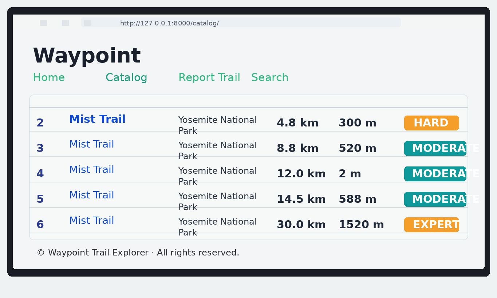
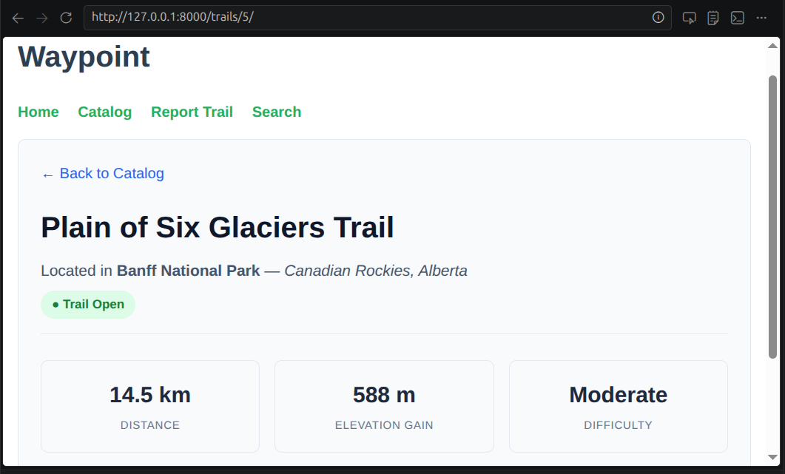
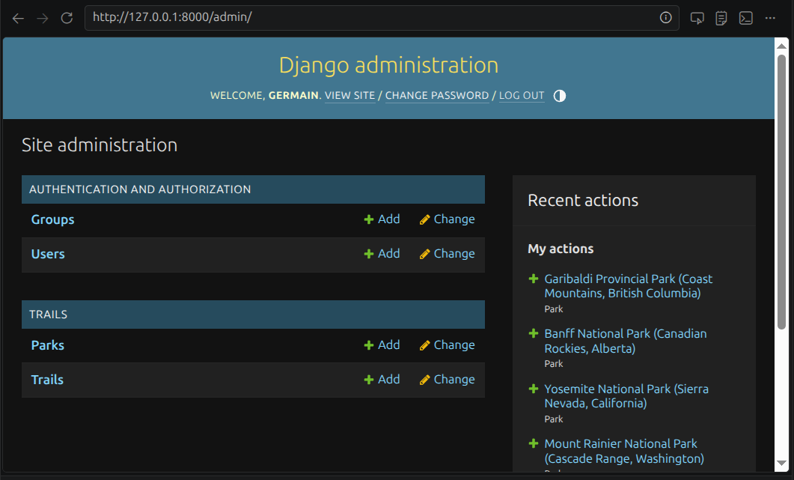

# Waypoint Trail Explorer

Waypoint is a Django web application designed for exploring outdoor trails, viewing park information, and managing hiking data through a clean catalog experience. The project combines a public-facing trail browser with an administrative dashboard for maintaining parks and trails.

## Project Overview

Waypoint helps users:

- Browse a trail catalog with distances, elevation gain, and difficulty ratings
- Filter trails by park
- View trail detail pages with location and status information
- Search for trails and navigation destinations
- Submit trail reports through the reporting form
- Manage trail and park records through the Django admin interface

This project is built as a practical web application using Django and SQLite, with HTML templates styled in a modern, hiking-focused design.

## Features

- Trail catalog with open trail listings
- Park-based filtering
- Trail detail pages and related trail suggestions
- Difficulty badges such as Easy, Moderate, Hard, and Expert
- Trail status indicators for open or closed routes
- Reporting form for trail updates and feedback
- Django admin support for Parks and Trails

## Tech Stack

- Python 3
- Django 4.x
- SQLite database
- HTML, CSS, and Django templates
- Django admin for content management

## Project Structure

- `trails/` — trail and park models, views, and tests
- `waypoint_web_app/` — project settings and URL routing
- `templates/` — page templates for the site
- `static/` — CSS and frontend assets
- `db.sqlite3` — local SQLite database
- `manage.py` — Django entry point

## Setup and Installation

1. Clone the repository:

   ```bash
   git clone https://github.com/GT-Codeur/waypoint-project.git
   cd waypoint
   ```

2. Create and activate a virtual environment:

   ```bash
   python3 -m venv .venv
   source .venv/bin/activate
   ```

3. Install dependencies:

   ```bash
   pip install -r requirements.txt
   ```

4. Apply database migrations:

   ```bash
   python manage.py migrate
   ```

5. Create an admin account:

   ```bash
   python manage.py createsuperuser
   ```

6. Start the development server:

   ```bash
   python manage.py runserver
   ```

## Run the Application

After starting the server, open the following pages in the browser:

- Public site: http://127.0.0.1:8000/
- Trail catalog: http://127.0.0.1:8000/catalog/
- Trail reporting form: http://127.0.0.1:8000/report/
- Search page: http://127.0.0.1:8000/search/
- Django admin: http://127.0.0.1:8000/admin/

## Screenshots

### Catalog View




### Django Admin View



## Sprint Checklist

The following checklist summarizes the sprint work completed for this project:

- [x] Sprint 1: Project setup and environment configuration
- [x] Sprint 2: Django project initialization and app structure
- [x] Sprint 3: Trail and park data model design
- [x] Sprint 4: Trail catalog, filters, and detail pages
- [x] Sprint 5: Search, reports, and user-facing navigation
- [x] Sprint 6: Django admin configuration and content management
- [x] Sprint 7: Frontend styling, template polish, and responsive layout
- [x] Sprint 8: Testing, validation, documentation, and final review

## Notes

This project is a strong example of a small but complete Django application that combines data modeling, user interactions, and administrative management in a single workflow. It is well-suited for demonstrating CRUD-style content management, query filtering, and template-driven UI development.

## Deployment and Future Enhancements

Possible improvements for future versions include:

- Add user authentication for trail reports
- Include map integration with trail coordinates
- Add photo galleries for parks and trails
- Expand filtering by difficulty, distance, and status
- Add API endpoints for external integrations

---

Waypoint Trail Explorer is a complete Django application for trail discovery and management, built to showcase clean UI design, data-driven catalog browsing, and practical admin workflows.